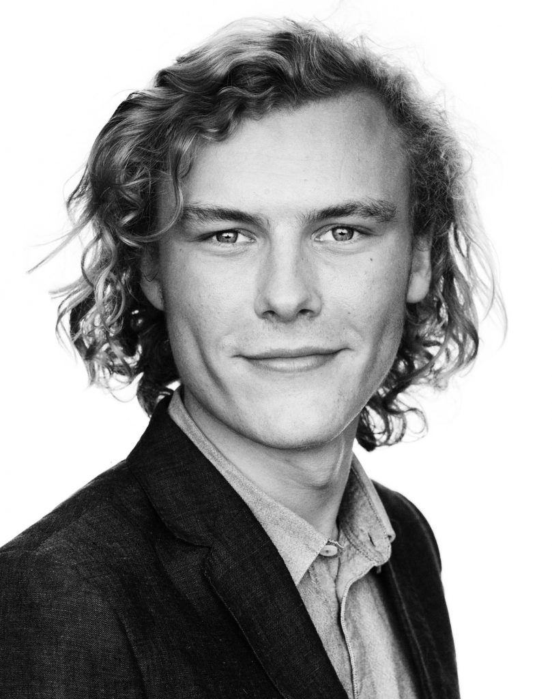

### High quality software development

Mattias, Founder

I am driven by technology that connects people and improves quality-of-life, and I have been developing websites and online platforms for many years.

I'm born and raised with a computer, and deployed my first website around 2002 when I was seven years old.

I also experiment around with a blog here on my website to share knowledge and thoughts about my interests, which includes, but is not limited to: hacking, startups, technology, online security, innovation, artificial intelligence, and software development.

Since 2002 I have founded several technology companies, helped many companies digitalise and had way too much caffeine. I have more than 10 years professional software engineering experience, and if you need help for a project, you can hire me. Learn more [about it here](http://constantsolutions.dk/media-and-press/).

I have professional working experience within: Software Architecture, Software Development (programming), cyber security,  front- & backend development (some call us full stack developers), algorithms, databases, optimization, and much more.

If you need help or advice for your project, [let's get in touch](http://constantsolutions.dk/contact/).
