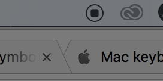

Anyone can record the screen easily.

If you prefer not to download any additional software to record your screen, chances are you already have a program that can do it for you. Luckily, if you're on Mac, you can simply open QuickTime Player. On Windows you'll need PowerPoint, or other download alternative (free) software - but don't worry, this is easy.

# On Mac OS

**Step 1:** Open QuickTime Player (installed on every mac), and from the top menu bar, click \[keybt\]New Screen Recording ⌃⌘N\[/keybt\].

**Step 2:** Ensure you use the **Internal Microphone** (then your voice may be heard). Optionally, you may also tick "Show Mouse Clicks in Recording".

**Step 3:** You're ready to record your screen. Click the big red recording button. You'll be able to choose whether you wish to record you whole screen, or only the part of the screen.

**Step 4:** End the recording by clicking the stop button in the menu bar.

# On Windows

The latest versions of PowerPoint include the feature to make a Screen Recording.

## How to record your screen using PowerPoint on Windows

**Step 1:** Go to the “Insert” tab, and select “Screen Recording.”

**Step 2:** Choose “Select Area” to choose the specific area of your screen you want to record. If you want to record the entire screen, press \[keybt\]Windows Key +Shift + F\[/keybt\]

**Step 3:** Click the “record” button,” or press\[keybt\]Windows Key +Shift + R\[/keybt\]

When you’re done you can save the video as a separate file to access or embed as you see fit.

## Don't have PowerPoint? Check out these alternative apps

If you don't have PowerPoint check out **[OBS Studio (free)](https://obsproject.com/download)** or **[Snagit (paid)](https://www.techsmith.com/store/snagit)**
