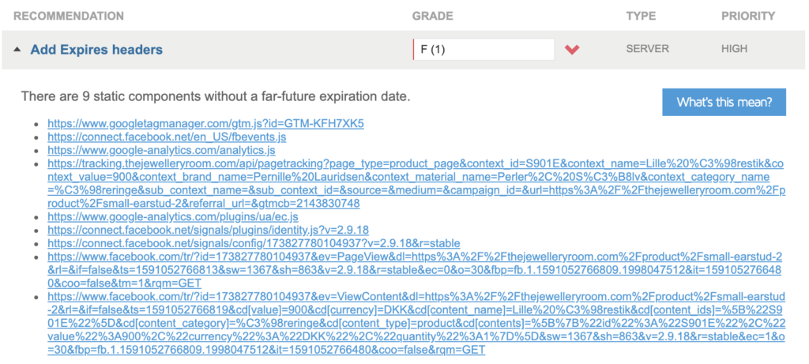
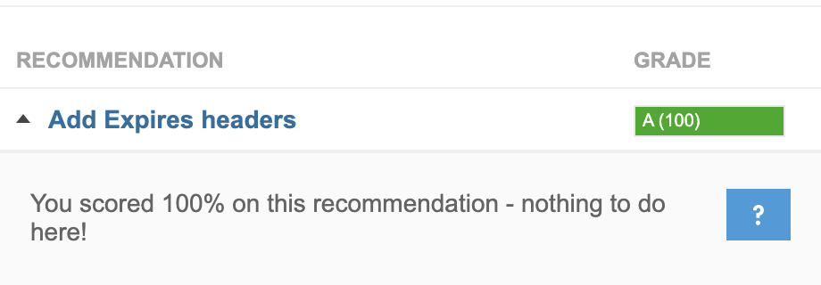

So I was recently doing some performance optimizations on a website, ensuring it loads as fast as possible, and that Search Engines like Google prioritize it over the competition.

I came across the "Add Expires headers" recommendation and was sad to realise we only scored "F" (i.e. 1/100 points):



It's funny that Google punishes it's own scripts, nevertheless, being the perfectionist I am, I had to come up with a solution.

To my surprise it was difficult for me when researching what others have done here. Most questions are about delaying the triggering of a specific Google Tag Manager tag, but that does not prevent the gtm.js / analytics.js script from being loaded, and thus results in a lower PageSpeed score.

## The problem

First of I tried to add "defer" to the script, meaning that it will first load, when everything else on the page has finished parsing. However, it didn't change much. There is also some issues that arises when you delay loading of the analytics / Google Tag Manager script (or other tracking scripts for that matter): less accurate results. Why? Because if the user leaves the page, before the script has been loaded, page views / events would not be tracked on that page.

## My solution:

To ensure the most accurate tracking statistics while keeping a high PageSpeed score, I came up with the following conditions for when the Google Tag Manager script should be appended

- 3500 milliseconds after `document` has fired its `DOMContentLoaded` event
- When user scrolls the page (PageSpeed test does not trigger scroll/click/mousemove events)
- When user moves the mouse on the page
- When user touches anywhere on the page (for mobile devices)

This seemed to load the tracking script, and PageSpeed tests would not penalize me for missing "Expires Headers".

Also, it would keep the amount of missing analytics to a minimum, because as soon as the user would move the mouse, scroll or interact with the page in any way, the tracking script would be initialized right away. Only scenario where the visitor would not be tracked, is if a user visits the webpage and decides to leave before ~3.5 seconds AND wasn't interacting with the website in ANY way (scrolling, moving mouse, etc). I'm not sure such a visit would have any real value to the marketing team anyway -- we'll see.

However, there was still one big issue: **PageView** events would not be tracked. I had to figure out why it didn't register the PageView event when script was added to the page later. If the script is added while the page is still loading, the **PageView** event gets fired. However, if it's added later (say 3 seconds after page has finished loading) no events are fired. Google Tag Manager's "Preview Mode" was a great tool in helping me figure out what triggers that fired which tags.

I realized PageView would be triggered on a specific event called \`gtm.js\`, so my solution was to add an `onLoad`callback to the tracking script, pushing this event manually into the `dataLayer`object.

Voila! It now works, and PageSpeed scores are higher than ever ;)



## The code

```
document.addEventListener('DOMContentLoaded', () => {
	/** init gtm after 3500 seconds - this could be adjusted */
	setTimeout(initGTM, 3500);
});
document.addEventListener('scroll', initGTMOnEvent);
document.addEventListener('mousemove', initGTMOnEvent);
document.addEventListener('touchstart', initGTMOnEvent);

function initGTMOnEvent (event) {
	initGTM();
	event.currentTarget.removeEventListener(event.type, initGTMOnEvent); // remove the event listener that got triggered
}

function initGTM () {
	if (window.gtmDidInit) {
		return false;
	}
	window.gtmDidInit = true; // flag to ensure script does not get added to DOM more than once.
	const script = document.createElement('script');
	script.type = 'text/javascript';
	script.async = true;
	script.onload = () => { dataLayer.push({ event: 'gtm.js', 'gtm.start': (new Date()).getTime(), 'gtm.uniqueEventId': 0 }); } // this part ensures PageViews is always tracked
	script.src = 'https://www.googletagmanager.com/gtm.js?id=YOUR-GTM-ID-HERE';

	document.head.appendChild(script);
}
```
